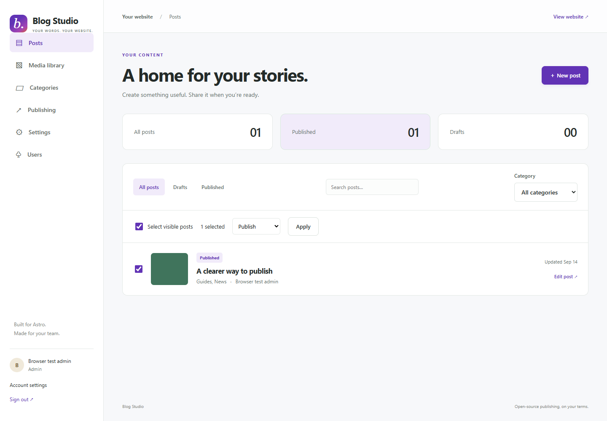
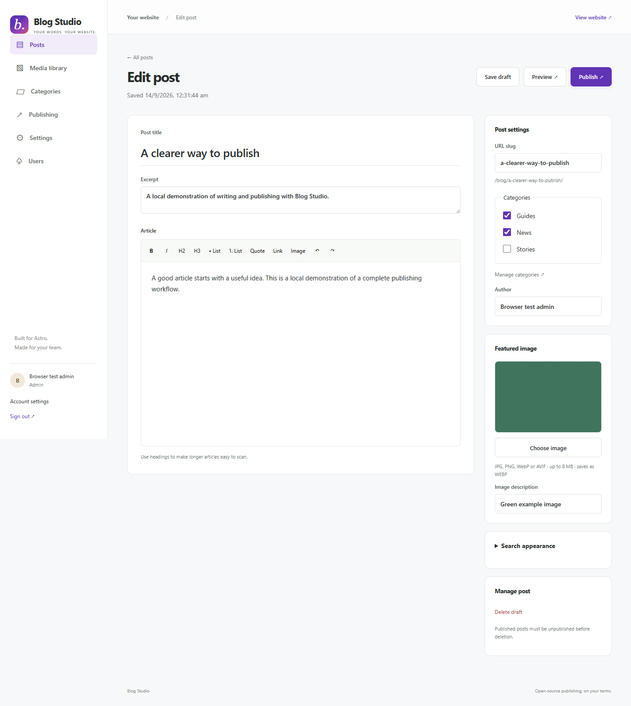
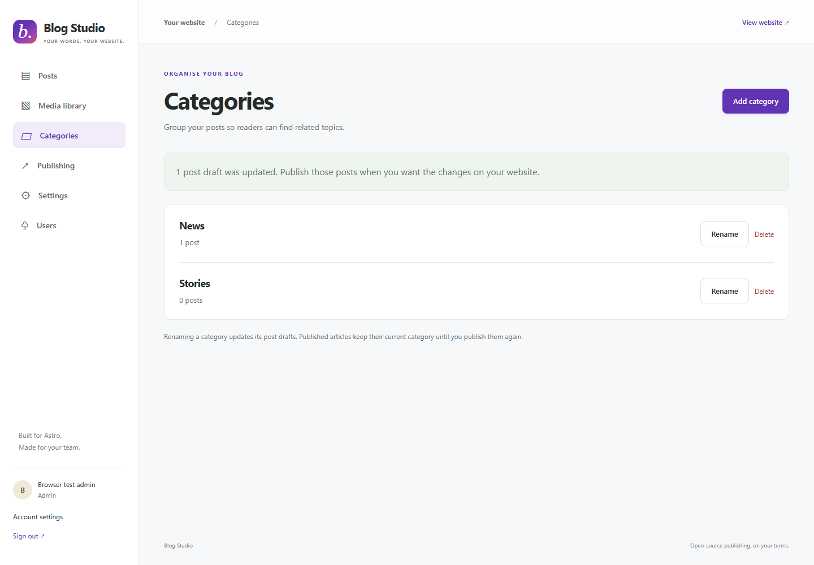
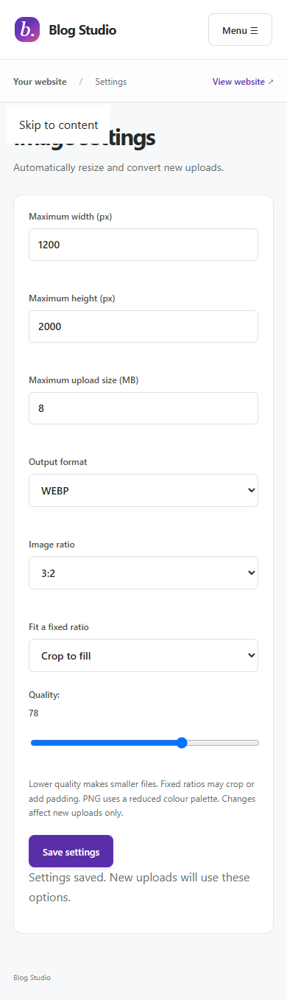

<div align="center">

# ABS · Astro Blog Studio

**A self-hosted writing and publishing dashboard for Astro websites.**

Write in a visual editor. Organise posts. Publish through Astro Content Collections.

[](LICENSE)
[](CHANGELOG.md)
[](https://nodejs.org/)
[](https://github.com/vijaykumarim/astro-blog-studio/actions/workflows/checks.yml)

[Quick start](#quick-start) · [Screenshots](#screenshots) · [Connect your site](docs/integration.md) · [Contributing](CONTRIBUTING.md)

</div>



## What is ABS?

ABS gives your team a dashboard for managing an Astro blog. Authors use a visual editor instead of editing Markdown files by hand. Administrators manage users, categories and image settings. Publishing builds a new static version of the website.

It is an **independent community project**, not an official Astro product. No paid CMS or hosted authentication service is required. ABS itself runs on **Node.js with SQLite**, and the public website remains an Astro project.

> **Early alpha:** local workflows are tested. Production hosting and deployment integration still need validation. This release does not include a ready-made remote deployment adapter.

## Features

| Writing and content | Publishing and administration |
| --- | --- |
| Tiptap visual editor with headings, lists, links and images | Save drafts, preview, publish and unpublish |
| Multiple categories per post | Category/status filters, search and bulk actions |
| Featured images and image descriptions | Admin/editor roles and invitation-only access |
| SEO title, description and URL slug | Last-active-admin protection |
| Image resizing, crop/padding and quality controls | Complete static releases with atomic activation |
| WebP, AVIF, JPEG and PNG output | Private build logs and database-aware backups |
| Responsive dashboard and app confirmation dialogs | Example Astro site with category archives, RSS, sitemap and search JSON |

## Quick start

Requires **Node.js 24.15+** and npm.

```sh
git clone https://github.com/vijaykumarim/astro-blog-studio.git
cd astro-blog-studio
npm ci
npm run setup
npm run admin -- "Your name" "you@example.com"
npm run dev
```

The admin command prints a private, single-use link. Open it to choose your password, then sign in at **http://127.0.0.1:4330**. No account or sample password is shipped with the project.

To see your published example website, open another terminal in the same folder:

```sh
npm run preview:site
```

Create and publish a post, then visit **http://127.0.0.1:4331/blog/**. The included example has no preloaded articles. [Full installation guide →](docs/installation.md)

## Screenshots

These are real interface screenshots captured with disposable sample content, not customer data. The interface uses the short name “Blog Studio”.

### Visual editor

Write your article, choose multiple categories and manage the featured image from one screen.



<details>
<summary><strong>Category management</strong></summary>

Administrators can add, rename and remove categories. Reassigning a category preserves the article and creates a new draft revision.



</details>

<details>
<summary><strong>Image settings on mobile</strong></summary>

Set upload limits, output dimensions, format, aspect ratio, crop/padding and quality. Settings affect new uploads; existing files are kept intact.



</details>

## How publishing works

```text
Write in ABS → Save a Markdown revision → Publish
                                           ↓
                              Snapshot of published content
                                           ↓
                                    Astro build
                                           ↓
                              Activate the complete release
```

Drafts are private and do not change the published website. ABS builds from immutable revisions. If a build fails, the previous release stays active. A bulk publish builds the selected posts together.

Your website keeps its own templates and design. ABS passes the published snapshot to your Astro build through environment variables. [Read the integration guide →](docs/integration.md)

## Project layout

```text
src/              Dashboard, editor, authentication and publishing
example-site/     Working Astro Content Collections integration
scripts/          Setup, administrator, backup and source export tools
tests/            Core and browser workflow tests
docs/             Setup guides and screenshots
studio.config.mjs Trusted site and build configuration
storage/          Private runtime data — excluded from Git
```

SQLite stores users, sessions, metadata and job state. Article revisions remain Markdown files. Uploads and built releases are stored privately under the configured storage directory. `.env`, databases, uploads, reset links and private build output must never be committed.

## Development and tests

```sh
npm run check
npm test
npm run build
npx playwright install chromium
npx playwright test
```

Tests use isolated data, not your working blog. GitHub Actions runs the checks on pushes and pull requests. [Contribution guide →](CONTRIBUTING.md)

## Import an existing blog

Administrators can import WordPress XML or JSON, download referenced images from the original website (including XML from Export media with selected content), or match a local uploads folder, review warnings and create drafts. ABS skips previously imported source URLs and can create old-to-new 301 mappings. The Redirects screen exports JSON, Nginx, Apache and Netlify rules for the website host.

[Import and redirect guide →](docs/migration.md)

## Media library

Click an image for its dimensions, file size, URL and **Delete image** action. Deletion uses an in-app confirmation and is blocked while the image is referenced by a draft or published post, or a build is running.

## Current limits

- One dashboard instance and publishing worker against local SQLite storage.
- Invitation/reset links are shared manually; email delivery is not included.
- Production deployment, scheduled publishing, automated rollback and retention management are not implemented.
- A different website design needs its own matching draft-preview adapter.
- Image settings process new uploads; original uploaded files are not retained for later conversion.
- Authentication and other open-source dependencies still need routine updates and testing.

For production, use HTTPS, a Node process manager, private persistent storage, backups and a tested deployment adapter. The bundled release server is a local preview helper. See [installation and hosting notes](docs/installation.md).

## Contributing and security

Bug reports and focused pull requests are welcome. Please read [CONTRIBUTING.md](CONTRIBUTING.md). Use example data in reports and screenshots.

For vulnerabilities, use the private reporting process in [SECURITY.md](SECURITY.md); do not post credentials or vulnerability details in public issues.

## Licence

[MIT](LICENSE) · Copyright © 2026 **Vijay Kumar and Astro Blog Studio contributors**.

The MIT licence covers original ABS code. Dependencies keep their own licences; see [THIRD_PARTY.md](THIRD_PARTY.md).
